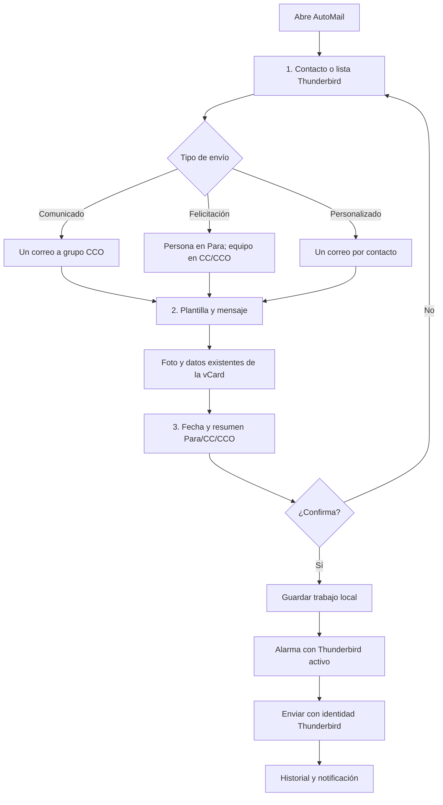

# App Flow simplificado

```mermaid
flowchart TD
 A[Abre AutoMail] --> B[1. Contacto o lista Thunderbird]
 B --> C{Tipo de envío}
 C -->|Comunicado| D[Un correo a grupo CCO]
 C -->|Felicitación| E[Persona en Para; equipo en CC/CCO]
 C -->|Personalizado| F[Un correo por contacto]
 D --> G[2. Plantilla y mensaje]
 E --> G
 F --> G
 G --> H[Foto y datos existentes de la vCard]
 H --> I[3. Fecha y resumen Para/CC/CCO]
 I --> J{¿Confirma?}
 J -->|No| B
 J -->|Sí| K[Guardar trabajo local]
 K --> L[Alarma con Thunderbird activo]
 L --> M[Enviar con identidad Thunderbird]
 M --> N[Historial y notificación]
```

La edición del contacto se hace en la libreta, sin fichas duplicadas.